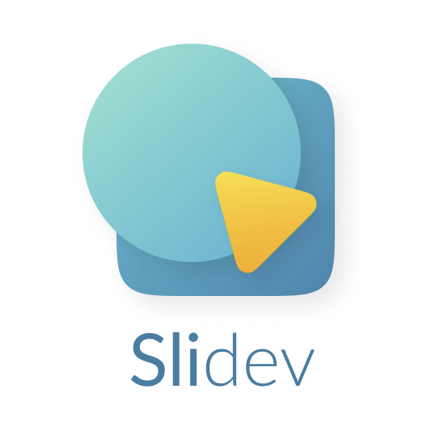
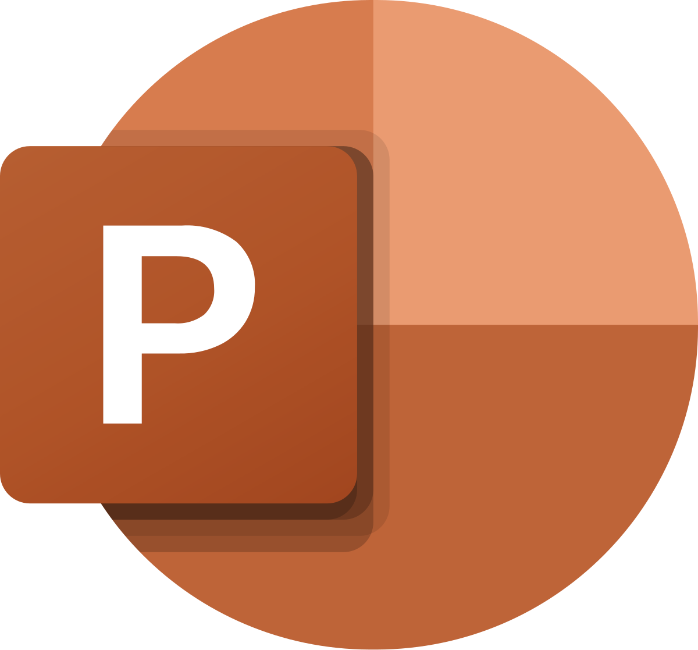

<h1>
  <SlideIn v-click mr-3>Making </SlideIn>
  <SlideIn v-click mr-3 underline>awesome </SlideIn>
  
  <br />
  <SlideIn v-click mr-3>presentations </SlideIn>

  <br />
  <SlideIn v-click mr-3>with </SlideIn>
  <SlideIn v-click mr-3 underline color="#72B7CF">Slidev</SlideIn>
</h1>

<SlideIn v-click>

## An intro to modern slideshows for developers - made with markdown

</SlideIn>

### Janis (janis.me, mail@janis.me)

<!--
Hey! Great to have you here.

This video is about: 
Making awesome presentations with slidev. 

An intro to modern slideshows for developers - made with markdown!

This is probably the way I will be making all of my youtube videos from now on, and I'm excited to show you how it's done.
-->

---
layout: intro
---

# We'll talk about

<v-clicks>

- What slidev is
- How to use it (in less than a minute)
- How to use it (properly)
- Customizing themes, layouts.. everything
- my (current) setup for creating slides

</v-clicks>

<!--
We well talk about
- What slidev is
- How to use it (in less than a minute)
- How to use it (properly)
- Customizing themes, layouts.. everything (because everything CAN be customized)
- my (current) setup for creating slides
-->

---
layout: center
---

<SlideIn>
  let's do this
</SlideIn>

<!--
let's do this
-->

---
layout: introVideo
transition: fade
---

<!--
intro
-->

---
transition: fade
layout: center
---

<SlideIn>
  A quick note
</SlideIn>

<!--
a quick note
-->

---
layout: two-cols-header
---

<h1 text-center>
This video is free, open source and interactive!
</h1>

::left::

<div text-center h-full flex flex-col justify-center>
  <SlideIn block v-click m-6>
    <fa7-solid:book text-4xl />
  </SlideIn>

  <SlideIn block v-click text-s m-1>
    janis.me/blog
  </SlideIn>
</div>

::right::

<div text-center h-full flex flex-col justify-center>
  <SlideIn block v-click m-6>
    <fa7-solid:code text-4xl />
  </SlideIn>

  <SlideIn block v-click text-s m-1>
    github.com/janis-me
  </SlideIn>
</div>

<!--
This video is free, open source and interactive!

- You can view it's dedicated blog article and the interactive slides 
- on my website,
- or view all of the sourcecode 
- at the github link in the description
-->

---

# What is slidev

Guess what, You're looking at it already. 😮

<div class="abs-tr mx-10 m-4 text-xl">
  
</div>

<v-clicks>

- Initiated by Anthony Fu
- "Presentation Slides for Developers"

</v-clicks>

<div class="inline-flex gap-5">
  <v-click>
    
  </v-click>
  <v-click>
    
  </v-click>
</div>

<!--
So, what is slidev?

Slidev was initiated by Anthony Fu, who you probably know from countless web-dev related things like Vue, Vite, Vitest, Nuxt, UnoCSS, node-modules.dev.. this dude is a literal machine.

It describes itself simply as `Presentation slides for developers`. I would describe it as the perfect superhuman hybrid of Brandon Eich and Microsoft PowerPoint.
-->

---
layout: center
---


<fa7-solid-ban v-click class="absolute left-95 bottom-43" text-9xl />

<!--
Comparing it to powerpoint is wrong in many ways though, because it is not a WYSIWYG editor, but instead based on simple markdown, with many extensions and some modifications though, we'll get to that.
-->

---

# Some code

```ts
const x = 1;

export default function fraaiaia(test: number) {
  console.log('hey');
}
```
